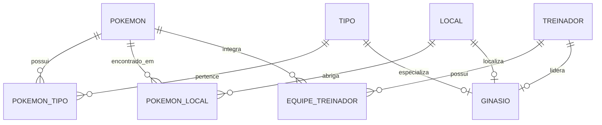

<div align="center">

# 🔥 🎮 Pokémon FireRed Version — SQL Server & Relational Database Lab

<p align="center">
  
  
  
  
  
  
</p>

[](#)
[](#)
[](#)
[](#)

*Laboratório prático de Engenharia de Dados, Modelagem Relacional (3FN) e T-SQL baseado na engine clássica do continente de Kanto (GBA).*

[📖 Sobre](#-sobre-o-projeto) •
[👾 Pokédex & Sprites](#-pokédex--sprites-do-firered) •
[🏛️ Estrutura](#%EF%B8%8F-estrutura-do-banco-de-dados-8-tabelas) •
[📖 Dicionário de Dados](#-dicionário-de-dados-completo) •
[📊 Consultas T-SQL](#-showcase-de-consultas-t-sql--resultados) •
[💡 Lições Aprendidas](#-desafios-técnicos--lições-aprendidas) •
[🗺️ Diagrama ER](#%EF%B8%8F-diagrama-entidade-relacionamento) •
[🚀 Insígnias de Kanto](#-roadmap-de-aprendizado-a-jornada-das-8-insígnias-de-kanto) •
[📁 Repositório](#-estrutura-do-repositório) •
[🛠️ Como Executar](#%EF%B8%8F-como-executar-o-projeto)

---
</div>

## 📌 Sobre o Projeto

Este repositório é um **laboratório educacional e portfólio de Banco de Dados Relacional** construído para acompanhar minha evolução contínua em **SQL Server (T-SQL)** e **Engenharia de Dados/DBA**.

O projeto utiliza o universo de **Pokémon FireRed (Game Boy Advance)** como estudo de caso real, mapeando as mecânicas do jogo para conceitos fundamentais de modelagem de dados.

> 💬 **Dica do Professor Carvalho:**  
> 👨‍🔬 *"Bem-vindo ao mundo do SQL Server! Este banco de dados foi projetado rigorosamente na 3ª Forma Normal (3FN), garantindo que a Pokédex, as equipes dos treinadores e os ginásios de Kanto mantenham integridade referencial total e zero redundância de dados!"*

<br>

<p align="center">
  
</p>

### 🎯 Resumo da Pokédex Cadastrada no Banco
| Atributo Mapeado | Quantidade Mapeada | Detalhes da Modelagem |
| :--- | :-: | :--- |
| 🐲 **Espécies Pokémon** | **151** | Tabela `POKEMON` (#001 Bulbasaur ao #151 Mew) |
| ⚡ **Tipos Elementares** | **15** | Tabela `TIPO` (Grass, Fire, Water, Electric, etc.) |
| 🔀 **Relacionamentos de Tipo** | **N:N** | Tabela associativa `POKEMON_TIPO` com Chave Primária Composta |
| 🗺️ **Locais de Kanto** | **Múltiplos** | Tabela `LOCAL` (Cidades, Rotas, Cavernas) |
| 🧢 **Treinadores & Rivais** | **Categorizados** | Tabela `TREINADOR` validada por restrição `CHECK` |
| 🏛️ **Ginásios Oficiais** | **8** | Tabela `GINASIO` ligando Líderes, Locais, Tipos e Insígnias |

---

## 👾 Pokédex & Sprites do FireRed

Abaixo está uma demonstração dos dados cadastrados no banco de dados utilizando os **sprites oficiais da versão FireRed/LeafGreen**:

### 🌟 Exemplo de Dados da Tabela `POKEMON`
| #ID | Sprite FireRed | Nome do Pokémon | Tipo Principal | Tipo Secundário |
| :-: | :-: | :--- | :--- | :--- |
| **#001** |  | **Bulbasaur** | `Grass` 🍃 | `Poison` ☠️ |
| **#004** |  | **Charmander** | `Fire` 🔥 | *Nenhum* |
| **#007** |  | **Squirtle** | `Water` 💧 | *Nenhum* |
| **#025** |  | **Pikachu** | `Electric` ⚡ | *Nenhum* |
| **#006** |  | **Charizard** | `Fire` 🔥 | `Flying` 🦅 |
| **#150** |  | **Mewtwo** | `Psychic` 🔮 | *Nenhum* |

<br>

### 🏆 Os 8 Líderes de Ginásio de Kanto Mapeados no Banco
| Ginásio | Cidade (`LOCAL`) | Líder (`TREINADOR`) | Insígnia | Pokémon Principal |
| :--- | :--- | :--- | :--- | :-: |
| **1º** | Pewter City | **Brock** | Boulder Badge 🪨 | <br>`Onix` |
| **2º** | Cerulean City | **Misty** | Cascade Badge 💧 | <br>`Starmie` |
| **3º** | Vermilion City | **Lt. Surge** | Thunder Badge ⚡ | <br>`Raichu` |
| **4º** | Celadon City | **Erika** | Rainbow Badge 🌈 | <br>`Vileplume` |
| **5º** | Fuchsia City | **Koga** | Soul Badge ☣️ | <br>`Weezing` |
| **6º** | Saffron City | **Sabrina** | Marsh Badge 🔮 | <br>`Alakazam` |
| **7º** | Cinnabar Island | **Blaine** | Volcano Badge 🔥 | <br>`Arcanine` |
| **8º** | Viridian City | **Giovanni** | Earth Badge 🌍 | <br>`Rhydon` |

---

## 🗄️ Estrutura do Banco de Dados (8 Tabelas)

<p align="center">
  
</p>

O banco é composto por **8 entidades relacionais** totalmente normalizadas:

| Tabela | Função no Sistema | Principais Restrições & Regras de Negócio |
| :--- | :--- | :--- |
| 🐲 **`POKEMON`** | Cadastro dos 151 Pokémon de Kanto | `PK_POKEMON`, `UQ_NOME_POKEMON` |
| ⚡ **`TIPO`** | Lista de elementos (Fire, Water, Grass...) | `PK_TIPO`, `UQ_NOME_TIPO` |
| 🔀 **`POKEMON_TIPO`** | Tabela associativa (N:N Pokémon/Tipos) | `PK_POKEMON_TIPO` (Composta por `ID_POKEMON` + `ID_TIPO`) |
| 🗺️ **`LOCAL`** | Cidades, rotas e cavernas de Kanto | `PK_ID_LOCAL`, `UQ_NOME_LOCAL` |
| 📍 **`POKEMON_LOCAL`** | Locais de aparição dos Pokémon (N:N) | `PK_POKEMON_LOCAL` (Composta por `ID_POKEMON` + `ID_LOCAL`) |
| 🧢 **`TREINADOR`** | Protagonista, Rival, Líderes e NPCs | `CK_TREINADOR_TIPO` (`CHECK IN ('PROTAGONISTA','LIDER',...)`) |
| ⚔️ **`EQUIPE_TREINADOR`** | Pokémon pertencentes a cada treinador | `CK_NIVEL` (`CHECK 1..100`), `PK` Composta |
| 🏛️ **`GINASIO`** | Os 8 Ginásios de Kanto e Insígnias | `FK`s para `LOCAL`, `TREINADOR` e `TIPO` |

---

## 📖 Dicionário de Dados Completo

<p align="center">
  
</p>

<details>
<summary>📚 <b>Clique aqui para expandir o Dicionário de Dados das 8 Tabelas T-SQL</b></summary>

<br>

#### 1. Tabela `POKEMON`
| Coluna | Tipo de Dado | Nulo? | Chave | Restrição | Descrição |
| :--- | :--- | :--- | :--- | :--- | :--- |
| `ID_POKEMON` | `INT` | `NOT NULL` | `PK` | `PK_POKEMON` | Número da Pokédex (#1 a #151) |
| `NOME` | `VARCHAR(100)` | `NOT NULL` | - | `UQ_NOME_POKEMON` | Nome único da espécie |

#### 2. Tabela `TIPO`
| Coluna | Tipo de Dado | Nulo? | Chave | Restrição | Descrição |
| :--- | :--- | :--- | :--- | :--- | :--- |
| `ID_TIPO` | `INT` | `NOT NULL` | `PK` | `PK_TIPO` | Identificador único do tipo |
| `NOME` | `VARCHAR(50)` | `NOT NULL` | - | `UQ_NOME_TIPO` | Nome do tipo elementar |

#### 3. Tabela `POKEMON_TIPO` (Associativa N:N)
| Coluna | Tipo de Dado | Nulo? | Chave | Restrição | Descrição |
| :--- | :--- | :--- | :--- | :--- | :--- |
| `ID_POKEMON` | `INT` | `NOT NULL` | `PK`, `FK` | `FK_POKEMON_TIPO_POKEMON` | Referência à tabela `POKEMON` |
| `ID_TIPO` | `INT` | `NOT NULL` | `PK`, `FK` | `FK_POKEMON_TIPO_TIPO` | Referência à tabela `TIPO` |

#### 4. Tabela `LOCAL`
| Coluna | Tipo de Dado | Nulo? | Chave | Restrição | Descrição |
| :--- | :--- | :--- | :--- | :--- | :--- |
| `ID_LOCAL` | `INT` | `NOT NULL` | `PK` | `PK_ID_LOCAL` | Identificador único do local |
| `NOME` | `VARCHAR(100)` | `NOT NULL` | - | `UQ_NOME_LOCAL` | Nome da cidade, rota ou caverna |

#### 5. Tabela `POKEMON_LOCAL` (Associativa N:N)
| Coluna | Tipo de Dado | Nulo? | Chave | Restrição | Descrição |
| :--- | :--- | :--- | :--- | :--- | :--- |
| `ID_POKEMON` | `INT` | `NOT NULL` | `PK`, `FK` | `FK_POKEMON_LOCAL_POKEMON` | Referência à tabela `POKEMON` |
| `ID_LOCAL` | `INT` | `NOT NULL` | `PK`, `FK` | `FK_POKEMON_LOCAL_LOCAL` | Referência à tabela `LOCAL` |

#### 6. Tabela `TREINADOR`
| Coluna | Tipo de Dado | Nulo? | Chave | Restrição | Descrição |
| :--- | :--- | :--- | :--- | :--- | :--- |
| `ID_TREINADOR` | `INT` | `NOT NULL` | `PK` | `PK_TREINADOR` | Identificador do treinador |
| `NOME` | `VARCHAR(100)` | `NOT NULL` | - | - | Nome do treinador |
| `TIPO_TREINADOR` | `VARCHAR(50)` | `NOT NULL` | - | `CK_TREINADOR_TIPO` | Categoria (`PROTAGONISTA`, `RIVAL`, `LIDER`, `NPC`) |

#### 7. Tabela `EQUIPE_TREINADOR` (Associativa N:N)
| Coluna | Tipo de Dado | Nulo? | Chave | Restrição | Descrição |
| :--- | :--- | :--- | :--- | :--- | :--- |
| `ID_TREINADOR` | `INT` | `NOT NULL` | `PK`, `FK` | `FK_EQUIPE_TREINADOR` | Referência à tabela `TREINADOR` |
| `ID_POKEMON` | `INT` | `NOT NULL` | `PK`, `FK` | `FK_EQUIPE_POKEMON` | Referência à tabela `POKEMON` |
| `NIVEL` | `TINYINT` | `NOT NULL` | - | `CK_NIVEL` | Nível do Pokémon (`CHECK 1..100`) |

#### 8. Tabela `GINASIO`
| Coluna | Tipo de Dado | Nulo? | Chave | Restrição | Descrição |
| :--- | :--- | :--- | :--- | :--- | :--- |
| `ID_GINASIO` | `INT` | `NOT NULL` | `PK` | `PK_GINASIO` | Identificador do ginásio (1 a 8) |
| `NOME` | `VARCHAR(100)` | `NOT NULL` | - | `UQ_NOME_GINASIO` | Nome oficial do ginásio |
| `INSIGNIA` | `VARCHAR(50)` | `NOT NULL` | - | `UQ_INSIGNIA` | Nome da insígnia oficial |
| `ID_LOCAL` | `INT` | `NOT NULL` | `FK` | `FK_GINASIO_LOCAL` | Cidade onde o ginásio se localiza |
| `ID_LIDER` | `INT` | `NOT NULL` | `FK` | `FK_GINASIO_LIDER` | Treinador que lidera o ginásio |
| `ID_TIPO_ESPECIALIZADO` | `INT` | `NOT NULL` | `FK` | `FK_GINASIO_TIPO` | Tipo elementar do ginásio |

</details>

---

## 📊 Showcase de Consultas T-SQL & Resultados

<p align="center">
  
</p>

Abaixo estão consultas desenvolvidas durante o estudo de T-SQL com comentários explicativos sobre cada comando:

### 🔍 Consulta 1: Filtro de Nomes com Operador `LIKE 'C%'`
Esta consulta utiliza o caractere coringa `%` para encontrar todos os Pokémon cujos nomes começam com a letra **C**:

```sql
-- Busca Pokémon cujos nomes iniciam com 'C'
SELECT 
     ID_POKEMON AS Pokedex
    ,NOME AS Pokemon
FROM POKEMON
WHERE NOME LIKE 'C%'  -- O caractere '%' indica qualquer sequência de caracteres após o 'C'
ORDER BY ID_POKEMON ASC;
```

**Resultado Retornado no SQL Server:**

| Pokedex | Sprite FireRed | Pokémon |
| :-: | :-: | :--- |
| **#004** |  | **Charmander** |
| **#005** |  | **Charmeleon** |
| **#006** |  | **Charizard** |
| **#010** |  | **Caterpie** |
| **#035** |  | **Clefairy** |
| **#036** |  | **Clefable** |

---

### 🔗 Consulta 2: Relacionamento N:N com `INNER JOIN`
Exibe os Pokémon e seus respectivos tipos elementares cruzando as tabelas `POKEMON`, `POKEMON_TIPO` e `TIPO`:

```sql
-- Relaciona Pokémon e seus Tipos cruzando a tabela associativa POKEMON_TIPO
SELECT 
     p.ID_POKEMON AS Pokedex
    ,p.NOME AS Pokemon
    ,t.NOME AS Tipo
FROM POKEMON p
INNER JOIN POKEMON_TIPO pt ON p.ID_POKEMON = pt.ID_POKEMON
INNER JOIN TIPO t ON pt.ID_TIPO = t.ID_TIPO
WHERE p.ID_POKEMON IN (1, 4, 7, 25)  -- Filtro para os iniciais + Pikachu
ORDER BY p.ID_POKEMON ASC;
```

**Resultado Retornado no SQL Server:**

| Pokedex | Sprite | Pokémon | Tipo Cadastrado |
| :-: | :-: | :--- | :--- |
| **#001** |  | **Bulbasaur** | `Grass` 🍃 |
| **#001** |  | **Bulbasaur** | `Poison` ☠️ |
| **#004** |  | **Charmander** | `Fire` 🔥 |
| **#007** |  | **Squirtle** | `Water` 💧 |
| **#025** |  | **Pikachu** | `Electric` ⚡ |

---

## 💡 Desafios Técnicos & Lições Aprendidas

<p align="center">
  
</p>

Durante o desenvolvimento do banco de dados, foram resolvidos desafios reais de modelagem e execução T-SQL:

* 🐛 **Refatoração Global de Nomenclatura (`ID_POKEMOM` → `ID_POKEMON`)**:
  * *Desafio:* Um erro de digitação na chave primária da tabela principal causava falhas ao declarar restrições de chave estrangeira (`FOREIGN KEY`).
  * *Solução:* Padronização completa em todos os arquivos de script DDL e DML para alinhar com o Dicionário de Dados.
* 🔒 **Tratamento de Violação de Chave Primária (Duplicidade no ID 101)**:
  * *Desafio:* O script de inserção dos Pokémon falhava na linha 101 por tentativa de duplicidade de `PRIMARY KEY`.
  * *Solução:* Tratamento da massa de dados DML, garantindo a carga fluida de 181 linhas de inserção sem erros de integridade.
* 🧠 **Diferença Conceitual entre PK Composta e FK Composta**:
  * *Aprendizado:* Nas tabelas associativas (`POKEMON_TIPO`, `EQUIPE_TREINADOR`), cada coluna aponta individualmente para sua tabela pai como uma `FOREIGN KEY`, mas a junção de ambas forma uma única **`PRIMARY KEY` composta**, impedindo combinações duplicadas.
* ✍️ **Estilo de Vírgula à Esquerda (*Leading Commas*)**:
  * *Boas Práticas:* Adoção do estilo de vírgula no início das linhas de DDL para facilitar a leitura e o versionamento de alterações (*diffs*) no Git/GitHub.

---

## 📐 Padrões Técnicos & Convenções T-SQL

### 1️⃣ Constraints Totalmente Nomeadas
Todas as restrições do banco foram explicitamente nomeadas para facilidade de auditoria e manutenção:

```sql
CONSTRAINT PK_POKEMON PRIMARY KEY (ID_POKEMON)
CONSTRAINT UQ_NOME_POKEMON UNIQUE (NOME)
CONSTRAINT FK_POKEMON_TIPO_POKEMON FOREIGN KEY (ID_POKEMON) REFERENCES POKEMON (ID_POKEMON)
CONSTRAINT CK_NIVEL CHECK (NIVEL >= 1 AND NIVEL <= 100)
```

### 2️⃣ Estilo de Vírgula à Esquerda (Leading Commas)
Padrão corporativo adotado na DDL para facilitar a inclusão/remoção de colunas no código:

```sql
CREATE TABLE POKEMON (
     ID_POKEMON INT NOT NULL
    ,NOME VARCHAR(100) NOT NULL
    ,CONSTRAINT PK_POKEMON PRIMARY KEY (ID_POKEMON)
    ,CONSTRAINT UQ_NOME_POKEMON UNIQUE (NOME)
)
GO
```

---

## 🗺️ Diagrama Entidade-Relacionamento

<p align="center">
  
</p>



<details>
<summary>🔍 Clique para ver a representação em texto do DER</summary>

```text
[POKEMON] ──< (POKEMON_TIPO) >── [TIPO]
    │
    └───< (POKEMON_LOCAL) >── [LOCAL]

[POKEMON] ──< (EQUIPE_TREINADOR) >── [TREINADOR]

[LOCAL] ─────< [GINASIO]
[TIPO]  ─────< [GINASIO]
[TREINADOR] ─< [GINASIO]
```
</details>

---

## 🚀 Roadmap de Aprendizado: A Jornada das 8 Insígnias de Kanto

<p align="center">
  
</p>

Meu aprendizado em SQL Server é estruturado como o desafio das 8 insígnias de Kanto:

- [x] 🪨 **1ª Insígnia (Rocha — Brock)**: Modelagem Relacional e DDL das 8 Tabelas (`01_create_tables.sql`).
- [x] 💧 **2ª Insígnia (Cascata — Misty)**: DML, Normalização e Carga dos 151 Pokémon (`02_insert_pokemon.sql`).
- [x] ⚡ **3ª Insígnia (Trovão — Lt. Surge)**: Consultas e Filtros Fundamentais (`SELECT`, `WHERE`, `LIKE 'C%'`, `IN`).
- [ ] 🌈 **4ª Insígnia (Arco-Íris — Erika)**: Junção de Tabelas (`INNER JOIN`, `LEFT JOIN`) no arquivo `04_queries.sql`.
- [ ] ☣️ **5ª Insígnia (Alma — Koga)**: Agrupamentos e Funções Agregadas (`GROUP BY`, `COUNT`, `HAVING`).
- [ ] 🔮 **6ª Insígnia (Lama — Sabrina)**: Visões de Banco de Dados (`VW_DETALHES_GINASIOS`).
- [ ] 🔥 **7ª Insígnia (Vulcão — Blaine)**: Automação e Procedimentos Armazenados (`Stored Procedures`).
- [ ] 🌍 **8ª Insígnia (Terra — Giovanni & Liga Pokémon)**: Repositório Final e Portfólio de Destaque no GitHub.

---

## 📁 Estrutura do Repositório

```text
pokemon-firered-database/
├── 📄 README.md                   # Documentação principal e guia do projeto
├── 📁 database/                   # Scripts SQL organizados por ordem de execução
│   ├── 01_create_tables.sql       # DDL: Criação das 8 tabelas e restrições
│   ├── 02_insert_pokemon.sql      # DML: Carga dos 151 Pokémon e tipos N:N
│   ├── 03_insert_game_data.sql    # DML: Locais, treinadores, equipes e ginásios
│   └── 04_queries.sql             # DQL: Banco de exercícios e consultas T-SQL
└── 📁 docs/                        # Diagramas e documentação complementar
    └── der.png                    # Diagrama Entidade-Relacionamento em imagem
```

---

## 🛠️ Como Executar o Projeto

<p align="center">
  
</p>

### Opção 1: Execução Manual (SSMS / Azure Data Studio / VS Code)
1. Certifique-se de ter o **SQL Server 2019+** instalado na sua máquina.
2. Clone o repositório:
   ```bash
   git clone https://github.com/DavidB4astos/pokemon-firered-database.git
   cd pokemon-firered-database
   ```
3. Execute os scripts em ordem sequencial no SGBD:
   - `database/01_create_tables.sql` (Estrutura de tabelas e restrições)
   - `database/02_insert_pokemon.sql` (Carga dos Pokémon e tipos N:N)
   - `database/03_insert_game_data.sql` (Locais, treinadores e ginásios)
   - `database/04_queries.sql` (Exercícios de consulta)

### Opção 2: 🐳 Quickstart via Docker Container
Você pode subir uma instância limpa do **SQL Server 2022** em poucos segundos via terminal:

```bash
# 1. Subir container do SQL Server 2022
docker run -e "ACCEPT_EULA=Y" -e "MSSQL_SA_PASSWORD=Pokemon@2026" \
   -p 1433:1433 --name sql_pokemon -d mcr.microsoft.com/mssql/server:2022-latest

# 2. Executar script DDL dentro do container
docker exec -it sql_pokemon /opt/mssql-tools/bin/sqlcmd \
   -S localhost -U sa -P "Pokemon@2026" -i /caminho/para/01_create_tables.sql
```

---

## 👨‍💻 Autor

**David Bastos**

[](https://www.linkedin.com/in/davidbastos13/)
[](https://github.com/DavidB4astos)

---

<div align="center">

<p align="center">
  
</p>

⚠️ *Disclaimer: Este projeto possui fins exclusivamente educacionais para aprendizado de Banco de Dados Relacional e T-SQL. Pokémon e todas as marcas associadas são de propriedade intelectual da Nintendo, Game Freak e Creatures Inc.*  
*Sprites fornecidos por [Pokémon Database](https://pokemondb.net/sprites).*  

⭐ *Se este projeto te ajudou ou te inspirou, considere dar uma estrela no repositório!*

</div>
